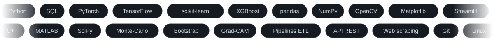

 

---

## À propos

Master 2 Mathématiques Appliquées (MApI3), Université Toulouse III Paul Sabatier, validé. Diplôme officiel délivré en décembre 2026.

Je transforme des données complexes en décisions fiables. J'interviens sur toute la chaîne : collecte Python, structuration SQL, modèles prédictifs, analyse statistique et simulation numérique. Deux stages en laboratoire de recherche (L2MGC et IRIT) m'ont permis de la pratiquer de la donnée brute jusqu'au modèle validé.

Je recherche mon premier poste de **Data Scientist**, **Data Analyst**, **Data Engineer** ou **ingénieur calcul scientifique**, en CDI ou CDD, partout en France.

## Expérience

- **Data Scientist stagiaire**, Laboratoire L2MGC, CY Cergy Paris Université (avril à juillet 2026) : pipeline de collecte et de nettoyage de données (+86 % de données exploitables), 6 modèles comparés, XGBoost meilleur avec R² = 0,76.
- **Stagiaire R&D en XAI**, Laboratoire IRIT, Université Toulouse III (mai à août 2025) : outils d'explicabilité pour CNN et ResNet (Grad-CAM), tableaux de bord interactifs et modules PyTorch réutilisables.

## Compétences

**Machine learning** : PyTorch · TensorFlow/Keras · scikit-learn · XGBoost · CNN · ResNet · LSTM · XAI (Grad-CAM) · LLM (API Gemini)
**Données** : SQL · API REST · web scraping · pipelines ETL · pandas · NumPy · statistiques inférentielles
**Calcul scientifique** : optimisation · méthodes numériques · Monte-Carlo · bootstrap · MATLAB · SciPy
**Outils** : Python · SQL · C++ · Git/GitHub · Jupyter · Streamlit · LaTeX · Linux (bases)
**Langues** : français courant · anglais B2

---

## Portfolio et contact

| | |
|:---|:---|
| **Portfolio** | <https://dialloalassane052001-ui.github.io/portfolio/> |
| **LinkedIn** | <https://www.linkedin.com/in/moussa-diallo-b203473a2/> |
| **Email** | <diallomoussa052001@gmail.com> |
| **Téléphone** | 06 65 78 47 63 |
